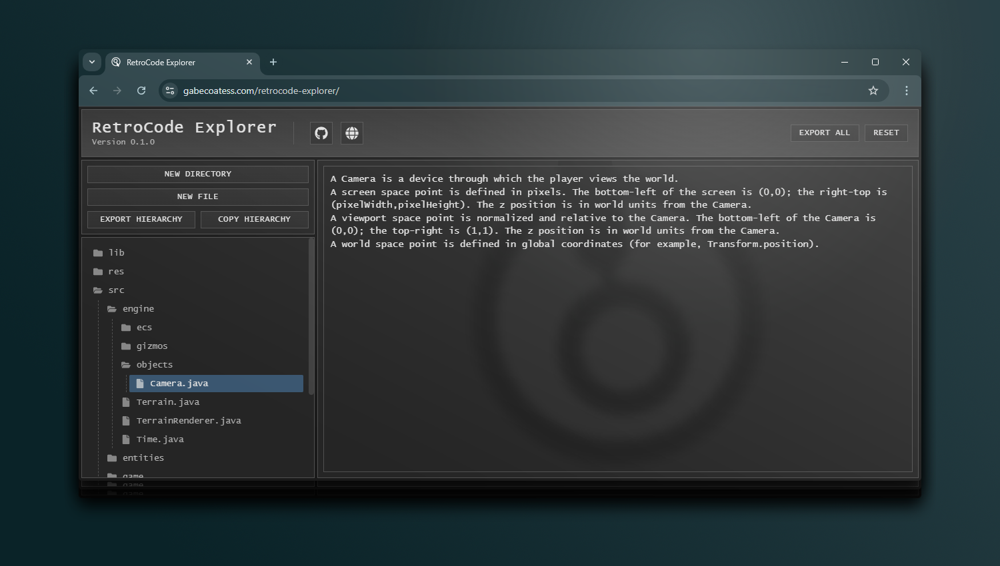

[![Issues][issues-shield]][issues-url]
[![MIT License][license-shield]][license-url]

<!-- PROJECT LOGO -->
 

  

<h3 align="center">RetroCode Explorer</h3>

  

    A simple web application used to recreate any project directory and assign descriptions to each file and folder at a high level.
     
    <a href="https://www.gabecoatess.com/retrocode-explorer">Go To Website</a>
    ·
    <a href="https://www.github.com/gabecoatess/retrocode-explorer/issues/new?labels=bug&template=bug-report---.md">Report Bug</a>
    ·
    <a href="https://www.github.com/gabecoatess/retrocode-explorer/issues/new?labels=enhancement&template=feature-request---.md">Request Feature</a>
  

<!-- TABLE OF CONTENTS -->

  
Table of Contents

  <ol>
    <li>
      <a href="#about-the-project">About The Project</a>
      <ul>
        <li><a href="#built-with">Built With</a></li>
      </ul>
    </li>
    <li><a href="#usage">Usage</a></li>
    <li><a href="#contributing">Contributing</a></li>
    <li><a href="#license">License</a></li>
    <li><a href="#contact">Contact</a></li>
  </ol>

<!-- ABOUT THE PROJECT -->
## About The Project

RetroCode Explorer was created for personal project management. The web application allows you to recreate any project directory and assign descriptions to each file and folder. This makes it easy to document how the project is structured from a very high level.

(<a href="#readme-top">back to top</a>)

### Built With

* [![React][React.js]][React-url]
* [![GitHub][GitHub Pages]][GitHubPages-url]

(<a href="#readme-top">back to top</a>)

<!-- GETTING STARTED -->
## Getting Started

1. Navigate to the [RetroCode Explorer website](https://gabecoatess.com/retrocode-explorer)
2. Recreate your directory structure by creating new directories, files, and renaming/positioning them
3. Select a file or folder you want to add a description to and start typing in the input box

### Exporting

- To bring up the export menu for just the hierarchy, you can click **EXPORT HIERARCHY** on the left sidebar
- To directly copy the hierarchy to your clipboard, you can click **COPY HIERARCHY** on the left sidebar
- To export the hierarchy and the description for each file, you can click **EXPORT ALL** at the top right of the page

(<a href="#readme-top">back to top</a>)

<!-- LICENSE -->
## License

Distributed under the Apache License 2.0 License. See `LICENSE.txt` for more information.

(<a href="#readme-top">back to top</a>)

<!-- CONTACT -->
## Contact

Gabriel Coates - gabrielrcoates@outlook.com

Project Link: [https://github.com/gabecoatess/retrocode-explorer](https://github.com/gabecoatess/retrocode-explorer)

(<a href="#readme-top">back to top</a>)

<!-- MARKDOWN LINKS & IMAGES -->
<!-- https://www.markdownguide.org/basic-syntax/#reference-style-links -->
[issues-shield]: https://img.shields.io/github/issues/gabecoatess/retrocode-explorer.svg?style=for-the-badge
[issues-url]: https://github.com/gabecoatess/retrocode-explorer/issues
[license-shield]: https://img.shields.io/github/license/gabecoatess/retrocode-explorer.svg?style=for-the-badge
[license-url]: https://github.com/gabecoatess/retrocode-explorer/blob/master/LICENSE.txt
[React.js]: https://img.shields.io/badge/React-20232A?style=for-the-badge&logo=react&logoColor=61DAFB
[React-url]: https://reactjs.org/
[GitHub Pages]: https://img.shields.io/badge/Github-20232A?style=for-the-badge&logo=github&logoColor=FFF
[GitHubPages-url]: https://pages.github.com/